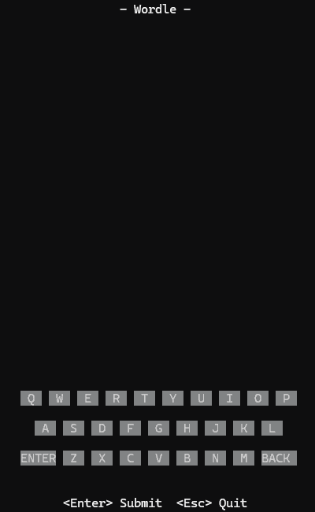
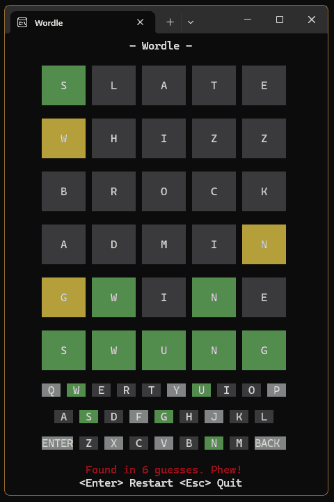

# wordle_tui

Wordle in the terminal: full-screen board, on-screen keyboard, mouse or keyboard input, and a 14,853-word dictionary — in a **64 KB** binary built on one dependency (`crossterm`, plus `crossterm_winapi` on Windows, already in crossterm's own tree) with no runtime files.

<p align="center">
  
</p>

```bash
cargo run --release
```

Rust stable, no prerequisites.
Windows and Linux are the tested targets.

## Playing

Six guesses at a hidden five-letter word.
A submitted guess must be in the dictionary; each letter comes back **green** (right letter, right place), **yellow** (right letter, elsewhere) or **grey** (absent), and the on-screen keyboard keeps the best score seen for every letter.

| Input | Action |
|-------|--------|
| `a`–`z` | type into the current row |
| `Backspace` | delete the last letter |
| `Enter` | submit the guess — or start a new game once won/lost |
| `Esc`, `Ctrl-C` | quit |
| Left click | press the on-screen key, or the `ENTER` / `BACK` button |

The layout adapts to the terminal: as height becomes available, features switch on in priority order — board, message line, keyboard, controls line, row gaps, full-height cells, title.
It still plays in a terminal only 5 columns by 6 rows.

<p align="center">
  
</p>

The game runs on the alternate screen and restores the terminal on exit (and on a panic, in the profiles that keep the panic hook).

## Build-time configuration

Both knobs are read by the build script and baked into generated constants; changing one triggers a rebuild of the compressed corpus.

| Variable | Default | Effect |
|----------|---------|--------|
| `WORDLE_WORD_LEN` | `5` | Selects the `res/{answer,valid}_words_N.txt` pair — 3 to 7 are provided |
| `WORDLE_MAX_GUESSES` | `6` | Number of guesses per game |

```bash
WORDLE_WORD_LEN=6 WORDLE_MAX_GUESSES=8 cargo build --release
```

```powershell
$env:WORDLE_WORD_LEN = '6'; $env:WORDLE_MAX_GUESSES = '8'; cargo build --release
```

## Word data

The two source lists — 2,339 answers plus 12,514 further accepted guesses, 14,853 words total — are merged and compressed at build time into a single arithmetic-coded stream: **14,283 bytes, 0.96 B per word**, including the bit that says which words are answers.
No word exists in the binary as text; lookups (`is_valid`, `pick_target`) decode the stream on the fly.
See [OPTIMIZATION.md](OPTIMIZATION.md) for how the encoding was arrived at.

## Repository layout

| Path | Contents |
|------|----------|
| `src/main.rs` | terminal setup, event loop, panic hook |
| `src/app.rs` | controller: draft input, messages, chrome |
| `src/game.rs` | rules: target, guesses, scoring, phase |
| `src/ui.rs` | layout, grid model, hit-testing, raw-ANSI renderer |
| `src/words.rs` | word database over the embedded corpus |
| `src/codec.rs` | range decoder and the model math both ends share |
| `build/` | build script: compresses `res/` into `corpus.bin` + `constants.rs` |
| `build/codec_enc.rs` | the encoder-only half of the codec, kept out of the binary |
| `res/` | source word lists, 3 to 7 letters |
| `docs/` | the README's demo GIFs |
| `tools/stats.rs` | compression and binary-size reporter (`cargo run --example stats`) |
| `tools/validate.sh` | one-shot tests + Windows/Linux builds + size report |
| `vendor/crossterm/` | patched crossterm 0.29.0, opt-in (see its `LOCAL_PATCH.md`) |

## Tests

```bash
cargo test
```

Covers the rules, the word database, and `corpus_round_trips` — the guard that the shipped corpus decodes bit-exactly to the words the build encoded.

## Binary size

Size is the project's main constraint; the whole record lives in [OPTIMIZATION.md](OPTIMIZATION.md).

| Profile | Windows | Linux (glibc) |
|---------|--------:|--------------:|
| First working TUI (baseline) | 396,288 | — |
| Stable, no prerequisites | 214,016 | 418,184 |
| `build-std`, nightly | 117,248 | 184,760 |
| `immediate-abort`, nightly | **64,297** | 85,703 |

## Documentation

- **[BUILD.md](BUILD.md)** — the build command for every profile on every platform.
- **[OPTIMIZATION.md](OPTIMIZATION.md)** — measured size changelog, measurement method, what is still stuck.
- **[vendor/crossterm/LOCAL_PATCH.md](vendor/crossterm/LOCAL_PATCH.md)** — what the vendored crossterm changes, and why.

## License

[MIT](LICENSE).

The vendored crossterm in `vendor/crossterm/` is MIT too, © 2019 Timon — its own [LICENSE](vendor/crossterm/LICENSE) applies to that subtree and is kept alongside it.
